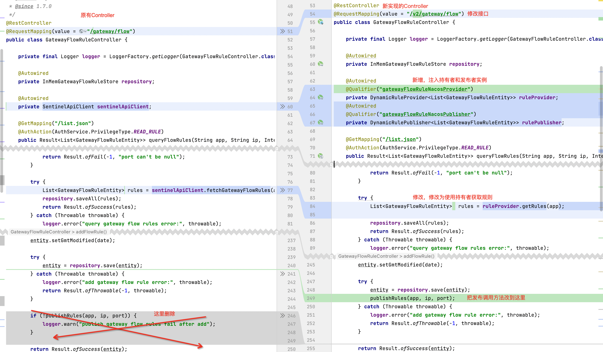
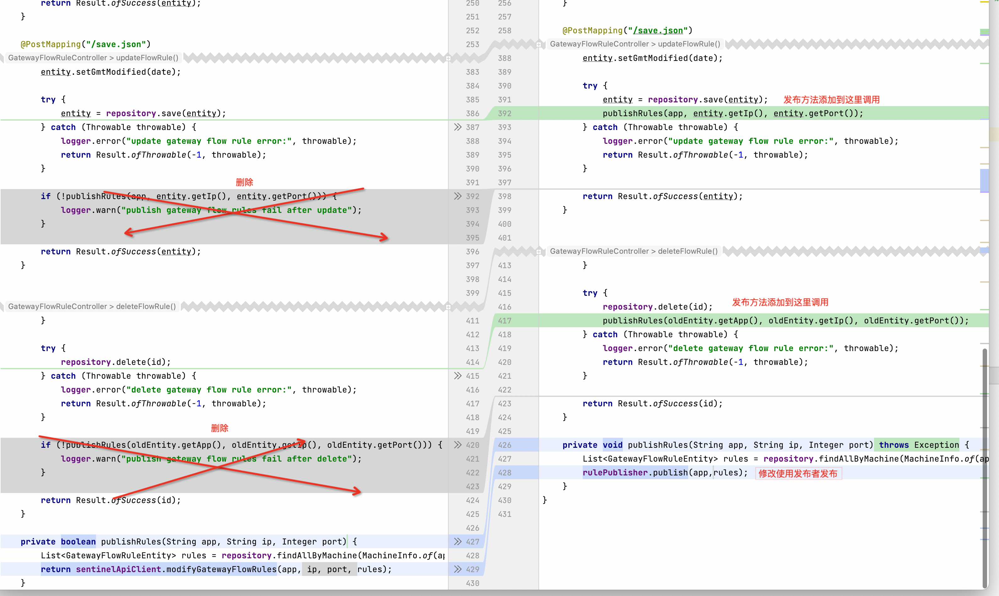
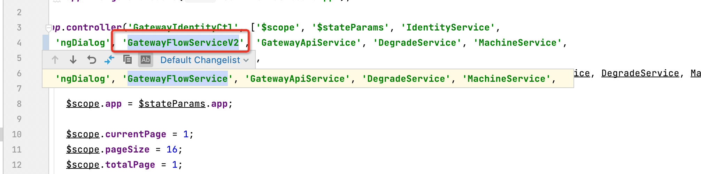
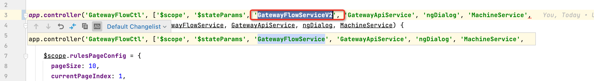
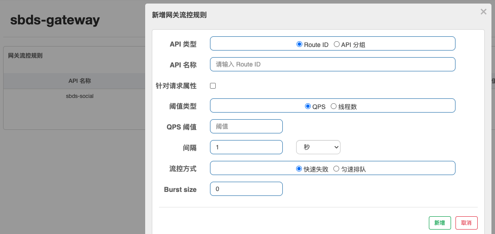
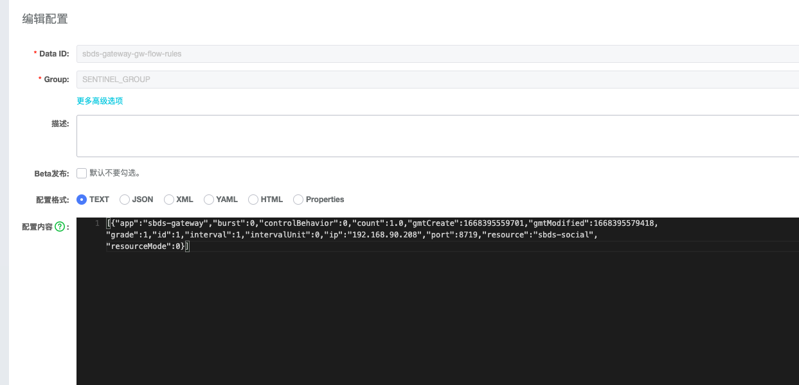
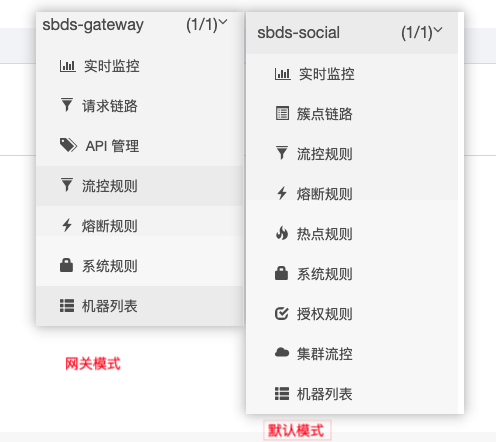
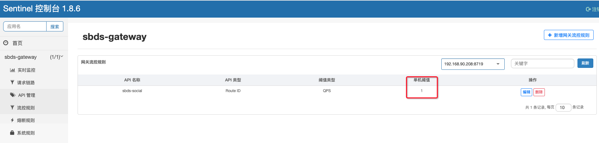
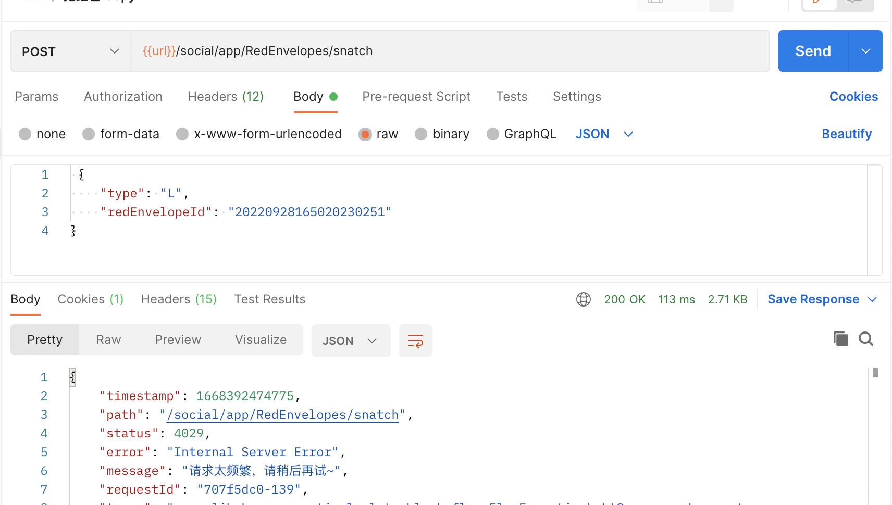

# 概述

**基于Sentinel1.8.6**，实现使用Sentinel + Nacos数据双向持久化存储

以SpringCloud Gateway集成Sentinel为示例，列举以下：

- 下载Sentinel源码

- 修改java源码实现Nacos持久化
- 修改前端源码对接新接口实现持久化
- 编译修改后的Sentinel前端后端代码
- Gateway集成Sentinel


# 下载Sentinel源码

Github：https://github.com/alibaba/Sentinel
版本 1.8.6

代码都在`sentinel-dashboard`模块下操作

把pom文件中的nacos依赖的scope作用域注释掉

```xml
<dependency>
    <groupId>com.alibaba.csp</groupId>
    <artifactId>sentinel-datasource-nacos</artifactId>
   <!-- <scope>test</scope>-->
</dependency>
```


# 使用Nacos实现持久化

## 修改后台源码

以实现网关流控规则存储为案例实现nacos持久化，分为以下步骤


### 0. 添加Nacos服务配置类

NacosConfigUtil.java

```java
public final class NacosConfigUtil {
    public static final String GROUP_ID = "SENTINEL_GROUP";
    /**
     * 流控规则文件名后缀
     */
    public static final String FLOW_DATA_ID_POSTFIX = "-flow-rules";
    public static final String GW_FLOW_DATA_ID_POSTFIX = "-gw-flow-rules";
    /**
     * 网关api配置文件名后缀
     */
    public static final String API_DATA_ID_POSTFIX = "-api-rules";
    /**
     * 热点参数配置文件名猴嘴
     */
    public static final String PARAM_FLOW_DATA_ID_POSTFIX = "-param-rules";
    public static final String CLUSTER_MAP_DATA_ID_POSTFIX = "-cluster-map";

  	//.....

    private NacosConfigUtil() {}
}
```

NacosProperties.java

```java
@Data
@ConfigurationProperties(prefix = "sentinel.nacos")
public class NacosProperties {
    /**
     * 服务地址
     */
    private String serverAddr;
    /**
     * 分组ID
     */
    private String groupId;
    /**
     * 命名空间
     */
    private String namespace;
}
```

NacosConfig.java

```java
@Configuration
//只有存在NacosProperties实体的时候才启用
@EnableConfigurationProperties(NacosProperties.class)
public class NacosConfig {
    private final NacosProperties nacosProperties;

    public NacosConfig(NacosProperties nacosProperties) {
        this.nacosProperties = nacosProperties;
    }

    @Bean
    public ConfigService nacosConfigService() throws Exception {
        String serverAddr = nacosProperties.getServerAddr();
        String namespace = nacosProperties.getNamespace();

        Properties properties = new Properties();
        //设置nacos服务地址
        properties.put(PropertyKeyConst.SERVER_ADDR, serverAddr);
        //设置nacos命名空间
        properties.put(PropertyKeyConst.NAMESPACE, namespace);

        return ConfigFactory.createConfigService(properties);
    }
}
```


### 1. 实现Converter接口，定义解码和编码器

由于后续还有api分组，普通限流模式下的流控等实现。

所以这里新增`ConverterConfiguration`配置类，专门用于初始化Converter。

```java
package com.alibaba.csp.sentinel.dashboard.config.nacos;

import com.alibaba.csp.sentinel.dashboard.datasource.entity.gateway.ApiDefinitionEntity;
import com.alibaba.csp.sentinel.dashboard.datasource.entity.gateway.GatewayFlowRuleEntity;
import com.alibaba.csp.sentinel.dashboard.datasource.entity.rule.FlowRuleEntity;
import com.alibaba.csp.sentinel.datasource.Converter;
import com.alibaba.fastjson.JSON;
import org.springframework.context.annotation.Bean;
import org.springframework.context.annotation.Configuration;

import java.util.List;

@Configuration
public class ConverterConfiguration {
    /**
     * 网关流控规则编码解码器
     * @return
     */
    @Bean
    public Converter<List<GatewayFlowRuleEntity>, String> gatewayFlowRuleEntityEncoder() {
        return JSON::toJSONString;
    }
    @Bean
    public Converter<String, List<GatewayFlowRuleEntity>> gatewayFlowRuleEntityDecoder() {
        return s -> JSON.parseArray(s, GatewayFlowRuleEntity.class);
    }
}
```


### 2. 实现动态规则提供者接口 DynamicRuleProvider

使用Nacos作为持久化，从Nacos获取规则配置的代码对于所有规则的代码流程基本都是一致的，唯一有区别的是dataId的获取。

所以这里抽象一个公用抽象类`AbstractNacosProvider`

```java
/**
 * 抽象公用Nacos配置持有者
 *
 * 用于从nacos中获取配置
 */
@Slf4j
@Component
public abstract class AbstractNacosProvider<T> implements DynamicRuleProvider<T> {
		@Autowired
    private ConfigService nacosConfigService;
		//这里会根据<T>的类型引入对应已经实现好的Converter
    @Autowired
    private Converter<String, T> converter;
    @Autowired
    private NacosProperties nacosProperties;

    @Override
    public T getRules(String appName) throws Exception {
        log.info("appName: {}", appName);
        log.info("Nacos Properties: {}", JSONObject.toJSONString(nacosProperties));

        String dataId = appName + this.getDataIdPostfix();
        String groupId = nacosProperties.getGroupId();

        String rules = configService.getConfig(dataId, groupId, 3000);

        log.info("getRules; dataId: {},groupId: {},rules: {}",dataId,groupId,rules);

        if (StringUtil.isEmpty(rules)) {
            return (T) new ArrayList();
        }
        return converter.convert(rules);
    }

    /**
     * 获取datId的文件后缀
     * @return
     */
    protected abstract String getDataIdPostfix();
}
```

#### 2.1. 实现网关流控规则持有者

用于从Nacos获取最新的规则

```java
/**
 * 网关流控规则Nacos持有者
 */
@Slf4j
@Component
public class GatewayFlowRuleNacosProvider extends AbstractNacosProvider<List<GatewayFlowRuleEntity>> {

    @Override
    protected String getDataIdPostfix() {
        return NacosConfigUtil.GW_FLOW_DATA_ID_POSTFIX;
    }
}
```


### 3. 实现动态规则发布者接口 DynamicRulePublisher

使用Nacos作为持久化，从Nacos获取规则配置的代码对于所有规则的代码流程基本都是一致的，唯一有区别的是dataId的获取。

所以这里抽象一个公用抽象类 `AbstractNacosPublisher`

```java
/**
 * 抽象公用Nacos规则发布者
 *
 * 用于把配置发布到nacos保存
 */
@Slf4j
@Component
public abstract class AbstractNacosPublisher<T> implements DynamicRulePublisher<T> {

    @Autowired
    private ConfigService nacosConfigService;
  	//这里会根据<T>的类型引入对应已经实现好的Converter
    @Autowired
    private Converter<T, String> converter;
    @Autowired
    private NacosProperties nacosProperties;

    @Override
    public void publish(String app, T rules) throws Exception {
        AssertUtil.notEmpty(app, "app name cannot be empty");
        if (rules == null) {
            return;
        }

        String dataId = app + this.getDataIdPostfix();
        String groupId = nacosProperties.getGroupId();

        log.info("publish; dataId: {},groupId: {},rules: {}",dataId,groupId,rules);

        nacosConfigService.publishConfig(dataId,groupId, converter.convert(rules));
    }

    /**
     * 获取datId的文件后缀
     * @return
     */
    protected abstract String getDataIdPostfix();
}
```


#### 3.1. 实现网关流控规则Nacos发布者

用于发布最新的配置到Nacos

```java
/**
 * 网关流控规则Nacos发布者
 */
@Component("gatewayFlowRuleNacosPublisher")
public class GatewayFlowRuleNacosPublisher extends AbstractNacosPublisher<List<GatewayFlowRuleEntity>> {

    @Override
    protected String getDataIdPostfix() {
        return NacosConfigUtil.GW_FLOW_DATA_ID_POSTFIX;
    }
}
```


### 4.添加新的Controller

复制一份Gateway原有的`GatewayFlowRuleController`，改名为 `GatewayFlowRuleControllerV2`

> 提示： 其他规则按照类似的写法实现修改即可

具体修改的地方可以参考下方的图片

```java
/**
 * 网关流控规则v2接口
 *
 * 持久化到nacos
 */
@RestController
//修改接口为v2版本
@RequestMapping(value = "/v2/gateway/flow")
public class GatewayFlowRuleControllerV2 {

    private final Logger logger = LoggerFactory.getLogger(GatewayFlowRuleControllerV2.class);

    @Autowired
    private InMemGatewayFlowRuleStore repository;

  	/**
  	 * 注入持有者和发布者实例
  	 */
    @Autowired
    @Qualifier("gatewayFlowRuleNacosProvider")
    private DynamicRuleProvider<List<GatewayFlowRuleEntity>> ruleProvider;
    @Autowired
    @Qualifier("gatewayFlowRuleNacosPublisher")
    private DynamicRulePublisher<List<GatewayFlowRuleEntity>> rulePublisher;

    @GetMapping("/list.json")
    @AuthAction(AuthService.PrivilegeType.READ_RULE)
    public Result<List<GatewayFlowRuleEntity>> queryFlowRules(String app) {

        if (StringUtil.isEmpty(app)) {
            return Result.ofFail(-1, "app can't be null or empty");
        }

        try {
          	//修改这里
            List<GatewayFlowRuleEntity>  rules = ruleProvider.getRules(app);

            repository.saveAll(rules);
            return Result.ofSuccess(rules);
        } catch (Throwable throwable) {
            logger.error("query gateway flow rules error:", throwable);
            return Result.ofThrowable(-1, throwable);
        }
    }

    @PostMapping("/new.json")
    @AuthAction(AuthService.PrivilegeType.WRITE_RULE)
    public Result<GatewayFlowRuleEntity> addFlowRule(@RequestBody AddFlowRuleReqVo reqVo) {

        //......其他代码不变，省略

        try {
            entity = repository.save(entity);
          	//修改这里
            publishRules(app, ip, port);
        } catch (Throwable throwable) {
            logger.error("add gateway flow rule error:", throwable);
            return Result.ofThrowable(-1, throwable);
        }

        return Result.ofSuccess(entity);
    }

    @PostMapping("/save.json")
    @AuthAction(AuthService.PrivilegeType.WRITE_RULE)
    public Result<GatewayFlowRuleEntity> updateFlowRule(@RequestBody UpdateFlowRuleReqVo reqVo) {

      	//......其他代码不变，省略

        try {
            entity = repository.save(entity);
          	//修改这里
            publishRules(app, entity.getIp(), entity.getPort());
        } catch (Throwable throwable) {
            logger.error("update gateway flow rule error:", throwable);
            return Result.ofThrowable(-1, throwable);
        }

        return Result.ofSuccess(entity);
    }


    @PostMapping("/delete.json")
    @AuthAction(AuthService.PrivilegeType.DELETE_RULE)
    public Result<Long> deleteFlowRule(Long id) {

        if (id == null) {
            return Result.ofFail(-1, "id can't be null");
        }

        GatewayFlowRuleEntity oldEntity = repository.findById(id);
        if (oldEntity == null) {
            return Result.ofSuccess(null);
        }

        try {
            repository.delete(id);
	          //修改这里
            publishRules(oldEntity.getApp(), oldEntity.getIp(), oldEntity.getPort());
        } catch (Throwable throwable) {
            logger.error("delete gateway flow rule error:", throwable);
            return Result.ofThrowable(-1, throwable);
        }

        return Result.ofSuccess(id);
    }

    private void publishRules(String app, String ip, Integer port) throws Exception {
        List<GatewayFlowRuleEntity> rules = repository.findAllByMachine(MachineInfo.of(app, ip, port));
      	//修改这里
        rulePublisher.publish(app,rules);
    }
}
```

以下是原controller和新controller的版本对比：






### 5. 添加properties配置

在配置文件中添加配置 `src/main/resources/application.properties`

这里使用启动参数传入的配置方式，方便后期修改nacos配置

`-Dnacos.server-addr=xxxxx -Dnacos.group-id=xxx -Dnacos.namespace=xxxx`

```properties
#nacos持久化存储流控配置
sentinel.nacos.serverAddr=${nacos.server-addr:localhost:8848}
sentinel.nacos.groupId=${nacos.group-id:SENTINEL_GROUP}
sentinel.nacos.namespace=${nacos.namespace:public}
```


## 修改前端源码

Sentinel的前端是使用angular.js实现的。以实现网关流控规则存储为案例，修改前端相关的代码，有以下步骤：

- 添加新的网关`folw_service_v2.js `业务实现
- 修改网关请求链路`identity.js`
- 修改网关流控`flow.js`
- 修改构建文件`gulpfile.js`


### 1. 添加网关GatewayFlowServiceV2业务实现

复制一份原有的网关`resources/app/scripts/services/gateway/flow_service.js`文件，并改名为`folw_service_v2.js`。

修改service名字为：`GatewayFlowServiceV2`

修改接口url为：`/v2` 开头

```js
var app = angular.module('sentinelDashboardApp');

//命名为：GatewayFlowServiceV2
app.service('GatewayFlowServiceV2', ['$http', function ($http) {
  this.queryRules = function (app, ip, port) {
    var param = {
      app: app,
      ip: ip,
      port: port
    };

    return $http({
      url: '/v2/gateway/flow/list.json',
      params: param,
      method: 'GET'
    });
  };

  this.newRule = function (rule) {
    return $http({
      url: '/v2/gateway/flow/new.json',
      data: rule,
      method: 'POST'
    });
  };

  this.saveRule = function (rule) {
    return $http({
      url: '/v2/gateway/flow/save.json',
      data: rule,
      method: 'POST'
    });
  };

  this.deleteRule = function (rule) {
    var param = {
      id: rule.id,
      app: rule.app
    };

    return $http({
      url: '/v2/gateway/flow/delete.json',
      params: param,
      method: 'POST'
    });
  };

  this.checkRuleValid = function (rule) {
    if (rule.resource === undefined || rule.resource === '') {
      alert('API名称不能为空');
      return false;
    }

    if (rule.paramItem != null) {
      if (rule.paramItem.parseStrategy == 2 ||
          rule.paramItem.parseStrategy == 3 ||
          rule.paramItem.parseStrategy == 4) {
        if (rule.paramItem.fieldName === undefined || rule.paramItem.fieldName === '') {
          alert('当参数属性为Header、URL参数、Cookie时，参数名称不能为空');
          return false;
        }

        if (rule.paramItem.pattern === '') {
          alert('匹配串不能为空');
          return false;
        }
      }
    }

    if (rule.count === undefined || rule.count < 0) {
      alert((rule.grade === 1 ? 'QPS阈值' : '线程数') + '必须大于等于 0');
      return false;
    }

    return true;
  };
}]);

```


### 2. 修改网关请求链路identity.js

修改原有的依赖注入`GatewayFlowService` 为 `GatewayFlowServiceV2`

- 文件路径：`resources/app/scripts/controllers/gateway/identity.js`




### 3. 修改网关流控flow.js

修改原有的依赖注入`GatewayFlowService` 为 `GatewayFlowServiceV2`

- 文件路径：`resources/app/scripts/controllers/gateway/flow.js`




### 4. 修改构建文件gulpfile.js

找到 JS_APP 常量，添加新增的网关业务实现js

```js
const JS_APP = [
  // ....
  //新增
  'app/scripts/services/gateway/flow_service_v2.js',
];
```

-  文件路径：`resources/gulpfile.js`

​		


## 编译前后端代码

### 编译前端代码

查看文件：`resources/README.md`


### 编译后端代码

```shell
mvn clean -Dmaven.skip.test=true package -f pom.xml
```


<font color="red">**以上是Sentinel集成Nacos持久化的基本核心流程，其他的规则实现持久化也是按照这样的流程实现即可。**</font>


## 启动Sentinel服务验证持久化存储

```shell
java -Dnacos.server-addr=127.0.0.1:8848 \
		-Dnacos.group-id=SENTINEL_GROUP \
		-Dnacos.namespace=local \
		-Dfile.encoding=UTF-8 \
		-jar sentinel-dashboard.jar
```


手工添加流控配置验证，查看Nacos






## Gateway集成Sentinel

Sentinel默认的流控配置界面是普通的流程配置，并没有网关想要的api分组等属于网关流控的配置界面。
在启动的时候需要指定当前项目的appType。

网关项目启动时，添加 `-Dcsp.sentinel.app.type=1`才可以开启网关模式。否则会以默认模式显示。

```shell
-Dcsp.sentinel.app.type=1
```



这里我们使用的是网关模式启动


### 在项目中添加依赖

```xml
<!-- 负责 sentinel 持久化 -->
<dependency>
  <groupId>com.alibaba.csp</groupId>
  <artifactId>sentinel-datasource-nacos</artifactId>
  <version>1.8.6</version>
</dependency>
<!-- sentinel -->
<dependency>
  <groupId>com.alibaba.cloud</groupId>
  <artifactId>spring-cloud-starter-alibaba-sentinel</artifactId>
</dependency>
<dependency>
  <groupId>com.alibaba.cloud</groupId>
  <artifactId>spring-cloud-alibaba-sentinel-gateway</artifactId>
  <version>2.2.0.RELEASE</version>
</dependency>
```

> 注：spring-cloud-alibaba-sentinel-gateway 一定需要使用2.2.0.RELEASE的版本，否则流控等会失效。


### 添加配置

```yaml
spring:
	cloud:
		#sentinel配置
    sentinel:
      #启动后马上初始化，而不是等有流量有再初始化。否则会提示：Runtime port not initialized, won't send heartbeat
      eager: true
      transport:
        # 控制台地址
        dashboard: localhost:8080
        # 客户端监控API的端口，默认8719，与Sentinel控制台做交互。有规则变化会把规则数据push给这个Http Server接收,然后注册到sentinel中
        port: 8719
      # Sentinel Nacos数据源配置，Nacos中的规则会⾃动同步到sentinel控制台的流控规则中
      # com.alibaba.cloud.sentinel.SentinelProperties.datasource
      # 配置了数据源后，在nacos修改中会自动同步到sentinel
      # ⾃定义数据源名,随意不重复即可；可多个
      # The following values are valid:
      # AUTHORITY,DEGRADE,FLOW,GW_API_GROUP,GW_FLOW,PARAM_FLOW,SYSTEM
      datasource:
        flow:
          # 指定数据源类型
          nacos:
            server-addr: ${nacos.server}
            data-id: ${spring.application.name}-gw-flow-rules
            namespace: ${nacos.namespace}
            # 默认分组：DEFAULT_GROUP
            group-id: SENTINEL_GROUP
            data-type: json
            rule-type: flow
        # api分组规则配置    
        gw-api-group:
          nacos:
            server-addr: ${nacos.server}
            data-id: ${spring.application.name}-api-rules
            namespace: ${nacos.namespace}
            # 默认分组：DEFAULT_GROUP
            group-id: SENTINEL_GROUP
            data-type: json
            rule-type: gw-api-group
```


### 添加自定义异常

```java
/**
 * 网关异常通用处理器，只作用在webflux 环境下 。
 * 优先级低于 {@link ResponseStatusExceptionHandler} 执行
 */
@Slf4j
@Order(-1)
public class GlobalErrorWebExceptionHandler extends DefaultErrorWebExceptionHandler {


    /**
     * Create a new {@code DefaultErrorWebExceptionHandler} instance.
     *
     * @param errorAttributes    the error attributes
     * @param resourceProperties the resources configuration properties
     * @param errorProperties    the error configuration properties
     * @param applicationContext the current application context
     */
    public GlobalErrorWebExceptionHandler(ErrorAttributes errorAttributes, ResourceProperties resourceProperties, ErrorProperties errorProperties, ApplicationContext applicationContext) {
        super(errorAttributes, resourceProperties, errorProperties, applicationContext);
    }


    /**
     * Extract the error attributes from the current request, to be used to populate error
     * views or JSON payloads.
     *
     * @param request the source request
     * @param options whether to include the error stacktrace information
     * @return the error attributes as a Map.
     */
    @Override
    protected Map<String, Object> getErrorAttributes(ServerRequest request, ErrorAttributeOptions options) {
        Throwable ex = super.getError(request);

        ResultBody resultBody;
       if (ex instanceof FlowException) {
            // 触发 Sentinel 流控规则
            resultBody = ResultBody.fail(ResultStatusCodeEnum.TOO_MANY_REQUESTS.getCode(), "请求太频繁，请稍后再试~", HttpStatus.TOO_MANY_REQUESTS.value());
        } else {
           // ......
        }
        Map<String, Object> errorAttributes = super.getErrorAttributes(request, options);
        errorAttributes.put("message", resultBody.getMessage());
        errorAttributes.put("code", resultBody.getCode());
        errorAttributes.put("method", request.methodName());
        errorAttributes.put("path", request.path());
        errorAttributes.put("traceId", TLogContext.getTraceId());
        errorAttributes.put("status", resultBody.getStatus());
        return errorAttributes;
    }

    /**
     * Get the HTTP error status information from the error map.
     *
     * @param errorAttributes the current error information
     * @return the error HTTP status
     */
    @Override
    protected int getHttpStatus(Map<String, Object> errorAttributes) {
        return HttpStatus.OK.value();
    }

    @Override
    protected RouterFunction<ServerResponse> getRoutingFunction(ErrorAttributes errorAttributes) {
        return RouterFunctions.route(RequestPredicates.all(), this::renderErrorResponse);
    }
}
```


### 启动网关及验证限流

添加流控配置



模拟请求，查看限流情况




# 运维编译和部署

### 1.1 如何编译

#### 1.1.1 控制台前端编译

使用npm命令：

```bash
# 安装依赖
npm i
# 构建
npm run build
```

#### 1.1.2 java后台编译

```bash
mvn clean package
```

### 1.2 如何启动

使用如下命令启动编译后的控制台：

```bash
java \ 
  -Dserver.port=8080 \
  -Dnacos.server-addr=127.0.0.1:8848 \
  -Dnacos.group-id=SENTINEL_GROUP \
  -Dnacos.namespace=local \
  -Dfile.encoding=UTF-8 \
  -Dsentinel.dashboard.auth.username=sentinel \
  -Dsentinel.dashboard.auth.password=123456 \
  -jar target/sentinel-dashboard.jar
```

上述 JVM 参数的含义是：

| 参数                                             | 作用                                                         |
| ------------------------------------------------ | ------------------------------------------------------------ |
| 服务端参数                                       |                                                              |
| `-Dserver.port=8080`                             | 指定服务端口                                                 |
| `Dfile.encoding=UTF-8`                           | 指定文件编码                                                 |
| `-Dsentinel.dashboard.auth.username=sentinel`    | 指定登录名                                                   |
| `-Dsentinel.dashboard.auth.password=123456`      | 指定登录密码                                                 |
| `-Dnacos.server-addr=127.0.0.1:8848`             | Nacos 服务地址                                               |
| `-Dnacos.group-id=SENTINEL_GROUP`                | Nacos Group                                                  |
| `-Dnacos.namespace=local`                        | Nacos 命名空间                                               |
| 客户端参数                                       |                                                              |
| `-Dcsp.sentinel.dashboard.server=localhost:8080` | 向 Sentinel 接入端指定控制台的地址                           |
| `-Dproject.name=sentinel-dashboard`              | 向 Sentinel 指定应用名称，比如上面对应的应用名称就为 `sentinel-dashboard` |

全部的配置项可以参考 [启动配置项文档](https://github.com/alibaba/Sentinel/wiki/%E5%90%AF%E5%8A%A8%E9%85%8D%E7%BD%AE%E9%A1%B9)。
